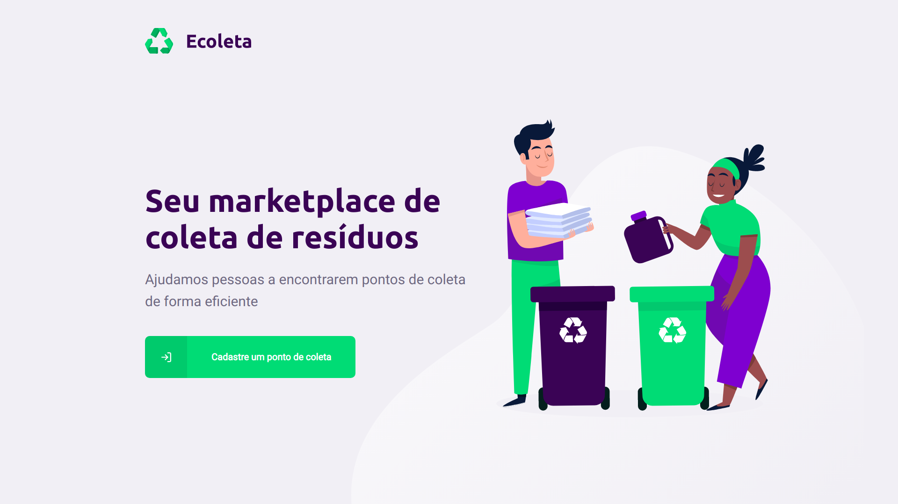
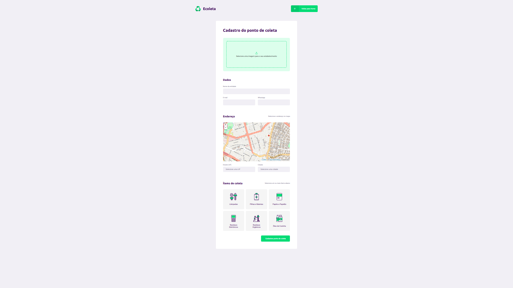
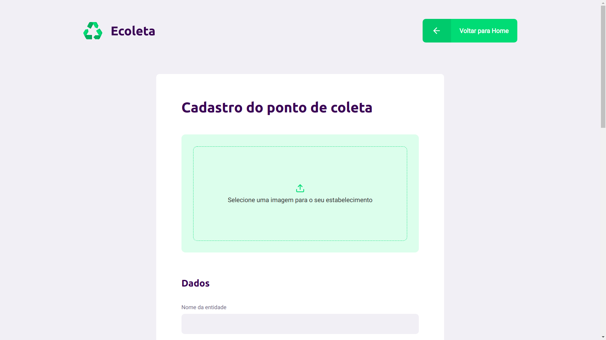
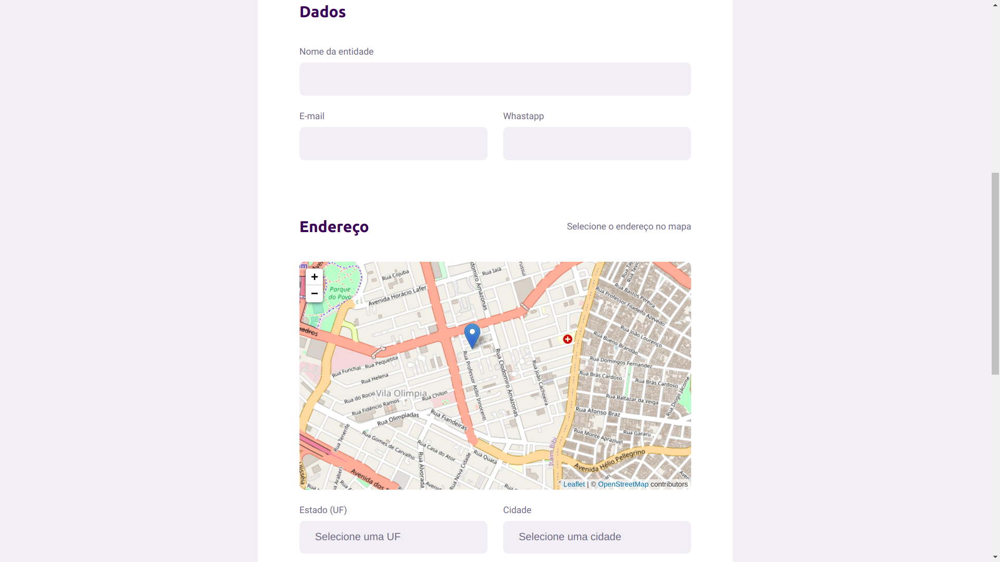
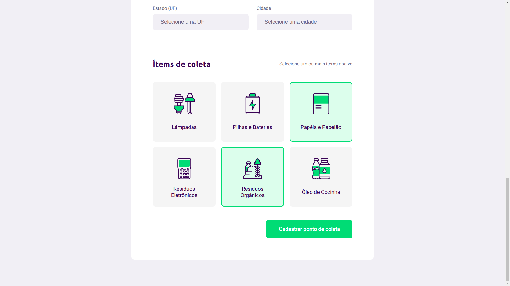

<h4 align="center">

<br>

<br><br>
♻️ Seu marketplace de coleta de resíduos ♻️
</h4>
<p align="center">
    
    
</p>

# :bulb: Sobre o projeto 

O projeto **Ecoleta** visa ajudar pessoas que tenham o interesse de descartar resíduos que possam agredir o meio ambiente em locais adequados onde poderam ser reciclados e reaproveitados.
Com isso você ajuda a preservar o nosso planeta reciclando.

# ⚙️ Como executar


Para executar e testar a aplicação na sua máquina, primeiramente faça um fork do projeto no seu computador.
Após fazer o fork e ter todos os arquivos na sua maquina, siga os seguintes passos:

#### Iniciar Servidor

Para instalar todas as dependências do servidor, entre na pasta **"./server"** e execute o seguinte comando:

```bash
npm install
```
Agora para criar a estrutura base do banco de dados, execute os comandos:

```bash
npm knex:migrate
npm knex:seed
```
Com as dependência instaladas e o banco de dados pronto, execute este comando para iniciar o servidor:

```bash
npm start
```

#### Iniciar App Web

Após iniciar a execução do servidor, inicie a aplicação web entrando na pasta **"./web"** e executando os comandos:

```bash
npm install
npm start
```

#### Iniciar App Mobile

Para executar o aplicação mobile é necessário ter o [Expo](https://expo.io/) instalado na sua máquina e no seu celular.
Com isso entre na pasta **"./mobile"** e execute os seguintes comandos:

```bash
npm install
expo start
```

Agora no seu celular, abra o aplicativo do **Expo** e escaneie o QRCode para iniciar.

**E pronto, agora você pode usar à vontade toda a aplicação.** :)

# 👨🏾‍💻 Técnologias

Segue abaixo uma lista com as principais técnologias utilizados no desenvolvimento desta aplicação. Lembrando que tudo foi desenvolvido utilizando a linguagem [Typescript](https://www.typescriptlang.org/).

#### ⚛️ Frameworks
- [x] [React Native](https://reactnative.dev/)
- [x] [Node.js](https://nodejs.org/en/) 
- [x] [React](https://pt-br.reactjs.org/)
- [x] [Expo](https://expo.io/)

#### 📚 Bibliotécas e Dependências
- [x] [React Navigation](https://reactnavigation.org/)
- [x] [React-Dropzone](https://github.com/react-dropzone/react-dropzone)
- [x] [Celebrate](https://github.com/arb/celebrate)
- [x] [Express](https://expressjs.com/)
- [x] [Leaflet](https://leafletjs.com/)
- [x] [Multer](https://github.com/expressjs/multer)
- [x] [Axios](https://github.com/axios/axios)

#### 🏦 Banco de dados
- [x] [SQLite](https://www.sqlite.org/index.html)
- [x] [Knex](http://knexjs.org/)

# :computer: Pagina Web

<p align="center">
  
  
  
  
  
</p>

# :iphone: App Mobile

<p align="center">
  ---| Em breve |---
</p>

 # :tv: Redes Sociais
 Me siga nas minhas redes sociais :)
 
   <a href="https://github.com/AbnerPS" target="_blank" >
    </a> 
  
  <a href="https://www.instagram.com/abner.p.s/" target="_blank" >
    </a> 
  
  <a href="https://www.facebook.com/AbnerGuthiwill" target="_blank" >
    </a> 

  <a href="https://www.linkedin.com/in/abner-pereira-silva-8715a326/" target="_blank" >
    </a>
